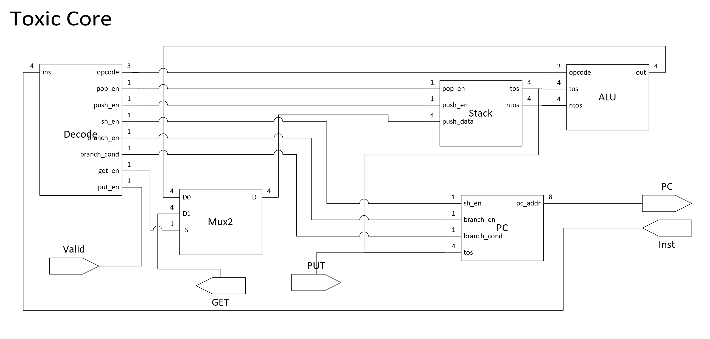

# Toxic v3 Chisel Implementation

3rd Generation of Toxic ISA imlementation. Maybe the simplest opensource processor. 

## Features
* Minimalism: 
    * Aming to provide an implementation under 400 logic gates.
    * It has in total 14 instructions while capable of performing basic MCU tasks.

## Implementation
* The whole processor is implemented in Chisel 
* Chisel code can be elaborated into Verilog HDL
### Design Block Diagram

### Synthesis Report (Using Quartus for Altera FPGAs)
| Resource      | #             |
| ------------- |:-------------:|
| Logic Elements| 206           |
| Registers     | 84            |
| Pins          | 23            |

## Get Started
* Install [Chisel3](https://github.com/freechipsproject/chisel3/blob/master/SETUP.md) first. (Make sure to install verilator and configure it to work with Chisel)
* Run the following code
``` 
make CoreTest
```
* Remember to do ```make clean``` each time before re-compile.
* The output of ".v" verilog file will be at ```./test_run_dir/toxic_v3.CoreSpec<seed>/Core.v```